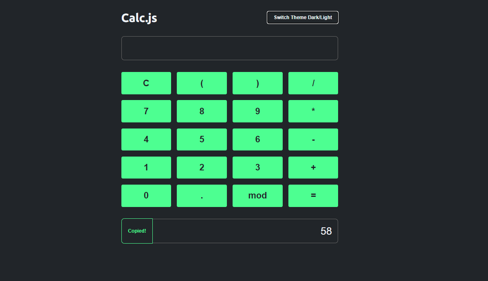

 <h1 align="center"> Dicionário pt-br </h1>
 
  

  
 
 ➡️ Acesse o projeto por <a href="https://crystie-pj5calculadora.netlify.app/" target="_blank"> aqui </a>⬅️

 

 
 
<h2> Coisas que aprendi em JavaScript </h2>
  <ol>
   <li> evento <code>'keydown'</code>: acionado quando uma tecla teclado é pressionada </li>
   <li> método <code>includes()</code>: verifica se há determinado valor em um array </li>
   <li> propriedade <code>.dataset</code>: lida com atributos de dados no html </li>
   <li> método <code>eval()</code>: avalia determinado código js e o executa (perigoso para avaliar dados sensíveis)</li>
   <li> propriedades <code>.style</code>: acessa propriedades de estilo </li>
   <li> propriedade <code>.currentTarget</code>: acessa o elemento em tratamento no evento atual </li>
  </ol>
 

<h2> 💡 Design </h2>
<a href="https://www.onebitcode.com/" target="_blank"> Origem da Ideia </a>
 
 

<h2> 👩‍💻 Autora </h2>
<h4 align="center"> Desenvolvido por <a href="https://www.linkedin.com/in/emilycrystie/" target="_blank"> Emily Crystie <a>  😎. <h4>
